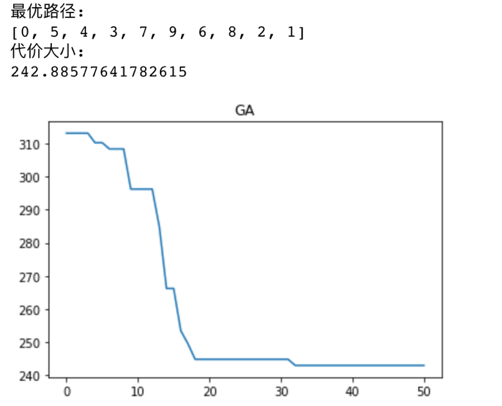

# GA-TSP
使用遗传算法解决旅行商问题

# 输入：
10城市坐标为：
- 1： (41, 94)；
- 2： (37, 84)；
- 3： (54, 67)；
- 4： (25, 62)；
- 5： (7, 64)；
- 6： (2, 99)；
- 7： (68, 58)；
- 8： (71, 44)；
- 9： (54, 62)；
- 10： (83, 69);

代码使用临接矩阵的形式保存城市之间的距离信息

# 输出：
1. TSP问题最优路径
2. 最优路径的代价
3. 最优路径代价变化图


# 运行环境：
Python 3.7

# 运行：
```
python GA.py
```

# 运行结果：
 
